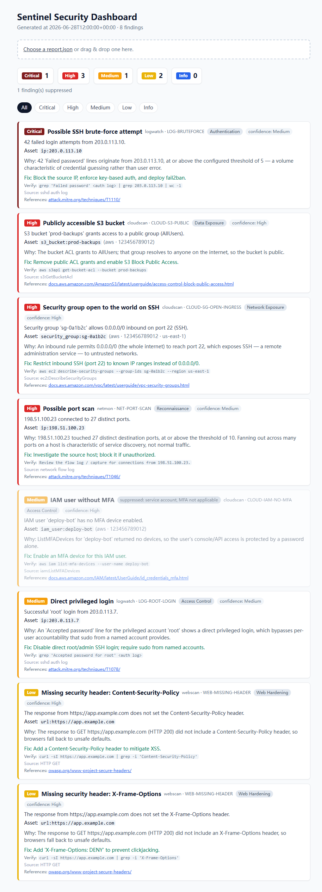

<div align="center">

# 🛡️ Sentinel

### One command. Four attack surfaces. One actionable report.

**Sentinel is a modular, defensive security toolkit.** It scans your cloud, logs, web apps, and
network with pluggable scanners, normalises everything into one finding model, and produces a
single prioritised report — with a concrete fix for every issue.

[](https://github.com/citizen204/sentinel-toolkit/actions/workflows/ci.yml)
[](https://github.com/citizen204/sentinel-toolkit/actions/workflows/codeql.yml)


[Quick start](#-quick-start) · [Modules](#-modules) · [Dashboard](#-dashboard) · [How it works](#%EF%B8%8F-how-it-works) · [Roadmap](#%EF%B8%8F-roadmap)



</div>

> ⚠️ **Authorized use only.** Sentinel performs read-only inspection. Run it only against
> accounts, systems, and applications you own or are explicitly authorized to audit.

---

## ✨ Why Sentinel

Security tooling is usually either a throwaway script or a heavyweight platform. Sentinel is the
middle ground — **one clean, tested codebase where each security domain is an independent module**
sharing common plumbing:

- 🧩 **Pluggable by design** — every scanner is a `BaseScanner` subclass that self-registers. Add a
  module, and the CLI picks it up with zero wiring changes.
- 🎯 **Remediation-first** — a finding that says *what's* wrong but not *how* to fix it is only half
  done. Every finding carries a concrete remediation step.
- 🔍 **Audit-grade evidence** — every finding answers *which API* produced it, *what was observed*,
  *why that is a failure*, and *how to verify the fix* — with the account and region attached.
  A failed check is reported as unassessed, never as a pass.
- 🧱 **One model to rule them all** — cloud, log, web, and network results all become the same
  `Finding`, bound to a structured **`Asset`** (provider/account/region/type/id) instead of a bare
  string — the difference between a flat report and a real security tool.
- 📚 **Rule catalog** — rule metadata (severity, category, MITRE/OWASP refs, confidence) lives in a
  central `Rule` registry, not scattered across check code. Browse it with `sentinel rules`.
- 🔕 **Grown-up noise control** — accept risks with expiring, reasoned **suppressions** (kept and
  counted in the report, not silently dropped), and **diff scans** for new/resolved/persisting
  findings via stable fingerprints.
- 🛟 **Resilient** — one broken scanner never crashes the run; its failure is reported as a finding
  and the rest keep going.
- 📤 **SARIF-native** — export to SARIF 2.1.0 and pipe findings straight into **GitHub code
  scanning**; every rule is tagged with a category and MITRE/OWASP/AWS reference.
- ✅ **Genuinely tested** — 70+ tests, CI on every push. AWS is mocked with `moto`, HTTP with
  `responses`, packets with `scapy` — the suite runs fully offline.

## 🧩 Modules

| Module | Domain | What it catches |
|:------:|--------|-----------------|
| ☁️ **`cloudscan`** | AWS misconfiguration | S3 (public ACL, no encryption/versioning/Block-Public-Access) · security groups open to `0.0.0.0/0` / `::/0` on SSH/RDP (all regions) · IAM (no MFA, no password policy, AdministratorAccess) · EBS/RDS unencrypted |
| 📜 **`logwatch`** | Log analysis (SIEM-lite) | SSH brute-force attempts · direct `root`/`admin` logins |
| 🌐 **`webscan`** | Web application | Missing security headers (HSTS, CSP, X-Content-Type-Options, X-Frame-Options) |
| 📡 **`netmon`** | Network traffic | Port scans · host sweeps — from a flow log **or a live/pcap capture via scapy** |

<details>
<summary><b>Full rule reference</b></summary>

| Rule ID | Module | Severity |
|---------|--------|:--------:|
| `CLOUD-S3-PUBLIC` | cloudscan | High |
| `CLOUD-S3-NO-ENCRYPTION` | cloudscan | Medium |
| `CLOUD-S3-NO-VERSIONING` | cloudscan | Low |
| `CLOUD-S3-NO-BPA` | cloudscan | Medium |
| `CLOUD-SG-OPEN-INGRESS` | cloudscan | High |
| `CLOUD-IAM-NO-MFA` | cloudscan | Medium |
| `CLOUD-IAM-NO-PASSWORD-POLICY` | cloudscan | Medium |
| `CLOUD-IAM-ADMIN-POLICY` | cloudscan | High |
| `CLOUD-EBS-UNENCRYPTED` | cloudscan | Medium |
| `CLOUD-RDS-UNENCRYPTED` | cloudscan | High |
| `LOG-BRUTEFORCE` | logwatch | High |
| `LOG-ROOT-LOGIN` | logwatch | Medium |
| `WEB-MISSING-HEADER` | webscan | Low–Medium |
| `NET-PORT-SCAN` | netmon | High |
| `NET-HOST-SWEEP` | netmon | Medium |

</details>

## 🚀 Quick start

```bash
git clone https://github.com/citizen204/sentinel-toolkit.git
cd sentinel-toolkit
python -m venv .venv && source .venv/bin/activate    # Windows: .venv\Scripts\Activate.ps1
pip install -e ".[dev]"

sentinel list-scanners      # what's available
sentinel scan-all           # run everything → reports/
```

Or with Docker:

```bash
docker build -t sentinel .
docker run --rm -v "$PWD/reports:/work/reports" sentinel scan-all
```

`cloudscan` needs only read-only AWS permissions — a least-privilege policy is in
[docs/aws-iam-policy.json](docs/aws-iam-policy.json).

**Auditing a whole organisation:** create that read-only role in each account (trusting your
audit principal), list the roles under `aws_accounts`, and give your principal `sts:AssumeRole`
on them. Sentinel assumes each role in turn, attributes every finding to its account, and keeps
scanning the remaining accounts if one is unreachable.

## 🎯 Usage

```console
$ sentinel scan cloudscan --format both
JSON report: reports/report-20260628T120000.json
HTML report: reports/report-20260628T120000.html
Scan complete: 3 finding(s).
```

Every finding is structured and tells you **how to fix it**:

```json
{
  "id": "CLOUD-S3-PUBLIC",
  "module": "cloudscan",
  "severity": "High",
  "title": "Publicly accessible S3 bucket",
  "description": "S3 bucket 'prod-backups' grants access to a public group (AllUsers).",
  "api": "s3:GetBucketAcl",
  "rationale": "The bucket ACL grants to AllUsers; that group resolves to anyone on the internet.",
  "evidence": { "bucket": "prod-backups", "public_grantees": ["...AllUsers"] },
  "remediation": "Remove public ACL grants and enable S3 Block Public Access.",
  "verify": "aws s3api get-bucket-acl --bucket prod-backups",
  "asset": { "provider": "aws", "type": "s3_bucket", "id": "prod-backups", "account_id": "123456789012" }
}
```

```bash
sentinel rules                             # browse the rule catalog
sentinel init-config                       # scaffold a sentinel.yaml to edit
sentinel scan <module>                     # run one scanner
sentinel scan-all                          # run every registered scanner
sentinel scan-all --exclude cloudscan      # skip a scanner (or --include webscan,logwatch)
sentinel scan-all --format sarif           # SARIF 2.1.0 → GitHub code scanning
sentinel scan-all --format all             # json + html + sarif at once
```

**Output formats:** `json` · `html` · `both` (default) · `sarif` · `all`. Invalid values are
rejected instead of silently producing nothing.

Track posture over time by diffing two JSON reports:

```bash
sentinel diff reports/last-week.json reports/today.json   # new / resolved / persisting
```

## 📊 Dashboard

A Next.js + Tailwind UI: severity summary, per-severity filtering, a card per finding, and
**drag-and-drop** to load any `report.json`.

```bash
cd dashboard
npm install
npm run dev            # http://localhost:3000
```

<div align="center"></div>

## 🏗️ How it works

Everything hangs off one idea: **every scanner emits the same `Finding`.**

```
scanner.run(config) ──▶ list[Finding] ──▶ aggregate + filter ──▶ report.json + report.html ──▶ dashboard
```

```
sentinel/
├─ core/            # shared kernel: Finding · Asset · Rule catalog · scanner registry · report
├─ modules/         # cloudscan · logwatch · webscan · netmon (checks/ = one function per rule)
├─ templates/       # HTML report template
└─ cli.py           # Typer CLI: list-scanners · scan <name> · scan-all
dashboard/          # Next.js + Tailwind UI for any report.json
```

Adding a scanner is a subclass — no core changes:

```python
from sentinel.core.scanner import BaseScanner
from sentinel.core.finding import Finding, Severity

class MyScanner(BaseScanner):
    name = "myscanner"
    def run(self, config) -> list[Finding]:
        return [Finding(id="MY-001", module="myscanner", severity=Severity.LOW,
                        title="...", description="...", remediation="...")]
```

## ⚙️ Configuration

Generate a starter file with `sentinel init-config`, then edit:

```yaml
# sentinel.yaml
aws_profile: my-audit-profile          # cloudscan
aws_regions:                           # cloudscan — regions to scan
  - us-east-1
  - ap-southeast-2
aws_accounts:                          # optional: audit many accounts via AssumeRole
  - role_arn: arn:aws:iam::111111111111:role/SentinelAudit
    regions: [us-east-1, ap-southeast-2]
  - role_arn: arn:aws:iam::222222222222:role/SentinelAudit
target_url: https://app.example.com    # webscan
log_paths:                             # logwatch
  - /var/log/auth.log
capture_file: capture.pcap             # netmon — a flow log OR a .pcap/.pcapng
ignore_ids:                            # hard-drop findings by rule id
  - CLOUD-IAM-NO-MFA
suppressions:                          # accepted risks: kept in the report, marked suppressed
  - rule: CLOUD-IAM-NO-MFA             # narrow by dedupe_key / rule / resource /
    resource: deploy-bot               #   account_id / region / asset_type / provider
    account_id: "123456789012"         # pin to one account so it can't match elsewhere
    reason: service account, MFA not applicable
    created_by: chilton                # audit trail
    ticket: SEC-123
    expires: 2027-01-01                # optional; suppression lapses after this date
profile: baseline                      # baseline (rule defaults) | strict (everything on)
rules:                                 # per-rule overrides
  LOG-BRUTEFORCE:
    threshold: 10                      # tune threshold-based rules
  CLOUD-S3-NO-VERSIONING:
    enabled: false                     # turn a rule off
  CLOUD-IAM-NO-MFA:
    severity: High                     # re-rate for your risk model
output_dir: reports
```

Scanner and check failures are never hidden by profiles or rule config — only real
findings can be tuned away.

## ✅ Testing & CI

```bash
pytest -q          # 70+ tests, fully offline
```

Every push and pull request runs on GitHub Actions (see the badges above): **pytest + `ruff`
lint** for the toolkit, a **dashboard eslint + build** job, and **CodeQL** static analysis for
Python and TypeScript. **Dependabot** keeps pip, npm, and Actions dependencies up to date. No
test touches a real cloud account, host, or network.

## 🗺️ Roadmap

- [x] Four scanner modules + unified reporting + dashboard
- [x] Failure isolation, pagination, ignore-list, scapy capture
- [x] SARIF output, multi-region AWS scanning, `init-config`, `--include/--exclude`
- [x] Deeper cloud checks (S3 encryption/versioning/BPA, IAM password policy + admin, EBS/RDS encryption)
- [x] Production hygiene: CodeQL, Dependabot, Docker, SECURITY/CONTRIBUTING/CHANGELOG
- [x] Suppressions (rule/resource/expiry/reason) and `sentinel diff` (new/resolved/persisting)
- [ ] Trend view across scans in the dashboard
- [ ] Markdown output format

## 🤝 Contributing

Issues and PRs are welcome — see [CONTRIBUTING.md](CONTRIBUTING.md) for setup, the checks to run,
and how to add a scanner or rule. Security reports: see [SECURITY.md](SECURITY.md). Release notes
live in [CHANGELOG.md](CHANGELOG.md).

## 👤 About

Built by **Xi (Chilton) Chen**, a cybersecurity undergraduate at the University of Adelaide, as a
hands-on portfolio project — a place to turn security concepts (access control, SIEM, web hardening,
network recon) into real, tested code. Feedback is genuinely welcome.

## 📄 License

[MIT](LICENSE) © Xi (Chilton) Chen
